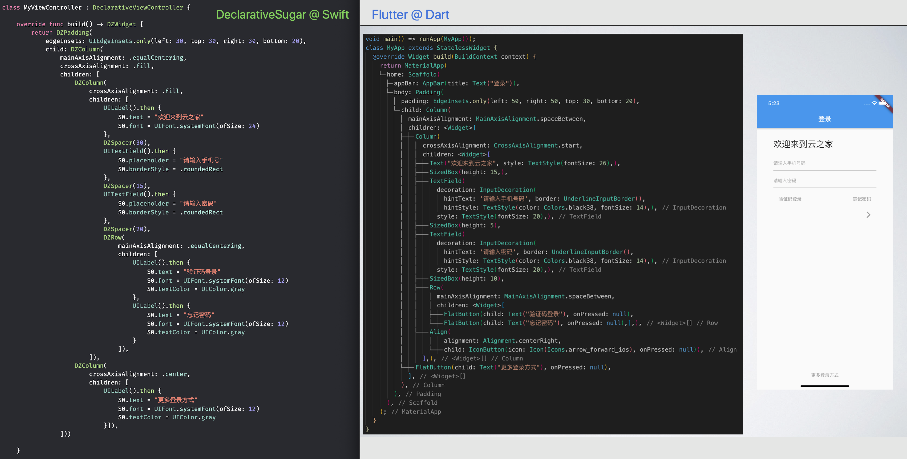
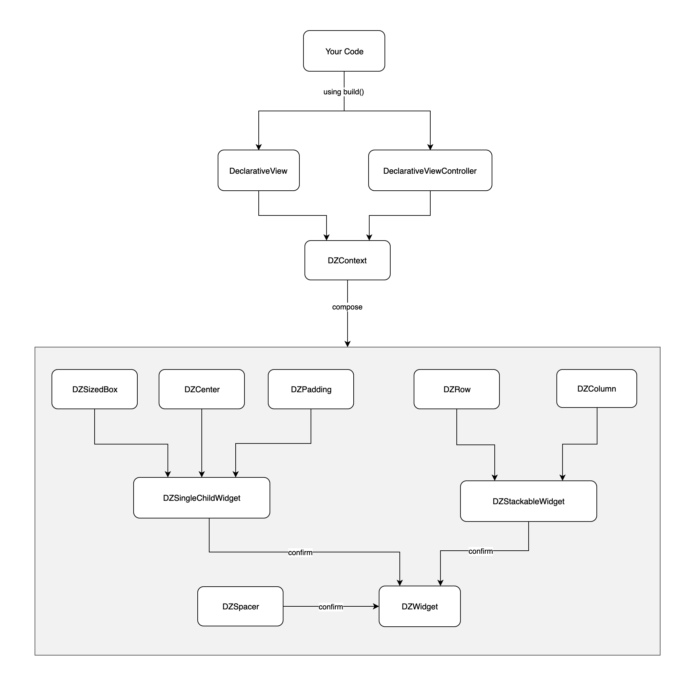

# DeclarativeSugar

> A lightweight Flutter-flavor declarative syntax sugar based on Swift and UIStackView

[中文介绍](https://juejin.im/post/5d47ec49e51d45620b21c35c)

## 0.Screenshot


**Comparing to Flutter**



## 1.Feature List

- [x] Declarative UI
- [x] Hide `UIStackView` complexity, use Flutter-ish API instead
- [x] composable view-hierachy as same as `UIStackView`
- [x] entry point `build()` and update method `rebuild()`   
- [x] `Row/Column`, `Spacer` 
- [x] `ListView` (`UITableView` in UIKit) #2019-08-03
- [x] `Padding` #2019-08-05
- [x] `Center`, `SizedBox` #2019-08-07

**Depolyment**: iOS 9, Swift 5  
**Dependency**: UIKit (*nothing else*)  

But I would suggest using [Then](https://github.com/devxoul/Then) for writing cleaner initializer.
The other goal is to remove the needs of using SnapKit or other autolayout framework.

## 2.Setup

### 2.1 Inherite `DeclarativeViewController` or `DeclarativeView`

``` swift
class ViewController: DeclarativeViewController {
    ...
}
```

### 2.2 Provide your own view-hierachy

This view will be added to `ViewController`'s root view with full screen constraints.

``` swift
override func build() -> DZWidget {
    return ...
}
```

## 3.Layout

### 3.1 Row

Layout views horizontally.

``` swift
DZRow(
    mainAxisAlignment: ... // UIStackView.Distribution
    crossAxisAlignment: ... // UIStackView.Alignment
    children: [
       ...
    ])
```

### 3.2 Column

Layout views vertically.

``` swift
DZColumn(
    mainAxisAlignment: ... // UIStackView.Distribution
    crossAxisAlignment: ... // UIStackView.Alignment
    children: [
       ...
    ])
```

### 3.3 Padding

Set padding for child widget.

only

``` swift
 DZPadding(
    edgeInsets: UIEdgeInsets.only(left: 10, top: 8, right: 10, bottom: 8),
    child: UILabel().then { $0.text = "hello world" }
 ),
```

symmetric

``` swift
 DZPadding(
    edgeInsets: UIEdgeInsets.symmetric(vertical: 10, horizontal: 20),
    child: UILabel().then { $0.text = "hello world" }
 ),
```

all

``` swift
 DZPadding(
    edgeInsets: UIEdgeInsets.all(16),
    child: UILabel().then { $0.text = "hello world" }
 ),
```

### 3.4 Center

Equivalent to centerX and centerY in autolayout.

``` swift
DZCenter(
    child: UILabel().then { $0.text = "hello world" }
)
```

### 3.5 SizedBox

Adding height and width constraints to the child.

``` swift
DZSizedBox(
    width: 50, 
    height: 50, 
    child: UIImageView(image: UIImage(named: "icon"))
)
```

### 3.6 Spacer

For `Row`: it is a `SizedBox` with width value.

```
DZRow(
    children: [
        ...
        DZSpacer(20), 
        ...
    ]
)
```

For `Column`: it is a `SizedBox` with height value.

```
DZColumn(
    children: [
        ...
        DZSpacer(20), 
        ...
    ]
)
```

### 3.7 ListView

Generally, you don't need to deal with delegate/datasource pattern and UITableViewCell

Static ListView

```
 DZListView(
    tableView: UITableView(),
    sections: [
        DZSection(
            cells: [
                DZCell(
                    widget: ...,
                DZCell(
                    widget: ...,
            ]),
        DZSection(
            cells: [
                DZCell(widget: ...) }
            ])
    ])
```

Dynamic ListView

Using `rows:` for single section list view

``` swift
return DZListView(
    tableView: UITableView(),
    cells: ["a", "b", "c", "d", "e"].map { model in 
        DZCell(widget: UILabel().then { $0.text = model })
    }
)
```

## 4. Reloading

### 4.1 Update state (reset completely)

``` swift
self.rebuild {
    self.hide = !self.hide
}
```

### 4.2 Update state (incremental)

``` swift
UIView.animate(withDuration: 0.5) {
    // incremental reload
    self.hide = !self.hide
    self.context.setSpacing(self.hide ? 50 : 10, for: self.spacer)
    self.context.setHidden(self.hide, for: self.label)
}
```

## 5 Code Structure



## 6 Example

To run the example project, clone the repo, and run `pod install` from the Example directory first.

## 7 Installation

DeclarativeSugar is available through [CocoaPods](https://cocoapods.org). To install
it, simply add the following line to your Podfile:

```ruby
pod 'DeclarativeSugar'
```

## 8 Author

Darren Zheng 623767307@qq.com

## 9 License

DeclarativeSugar is available under the MIT license. See the LICENSE file for more info.
